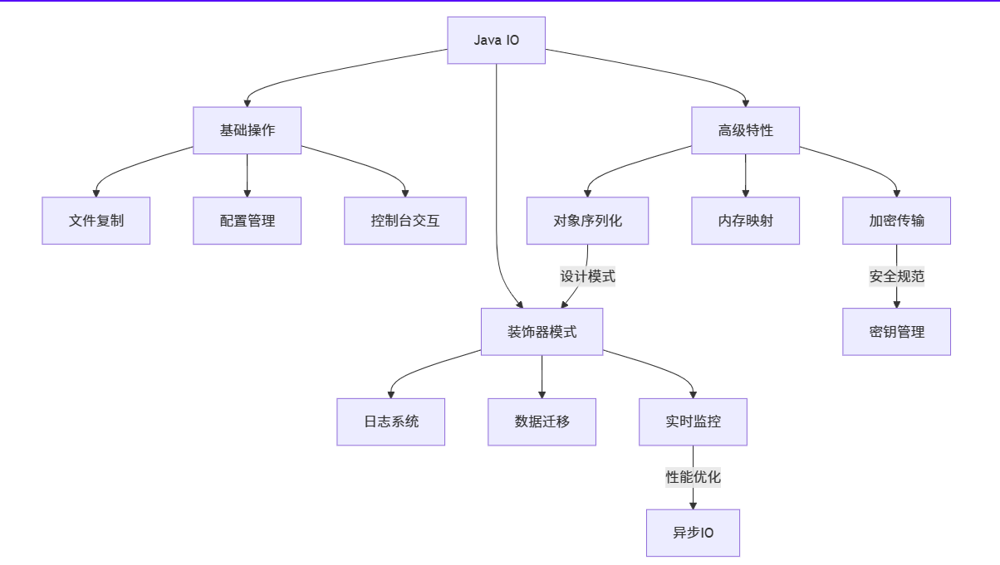
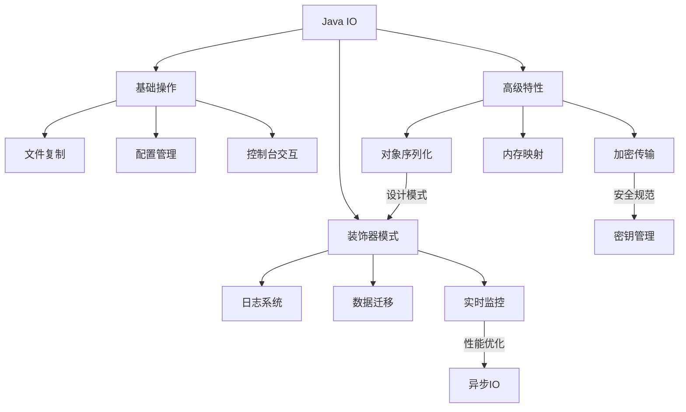

# 初学Java案例

## 1. Git初始化

### 1.1 初始化本地仓库

```
git init
```

### 1.2 关联远程仓库

```
git remote add origin https://github.com/yourusername/javacode.git
```

### 1.3 添加并提交本地代码

```
git add .
git commit -m "Initial commit"
```

### 1.4 推送代码到远程仓库

```
git push -u origin master
```

### 仓库级配置代理
```shell
git config http.proxy 'http://proxy.server:port'
git config https.proxy 'https://proxy.server:port'
```

## 2. Java处理excel表格

## 3. Java多线程处理文本文件

## 4. 高效拷贝文件



